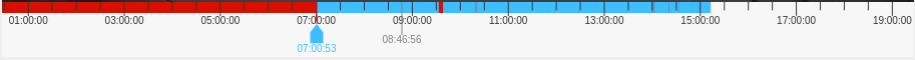

# NgxTimeliner

## Описание
Библиотека таймлайна для видеоплеера



## Установка

#### Compatibility

## Установка зависимостей
```
npm i ngx-timeliner --save
```
или
```
yarn add ngx-timeliner
```
## Использование
Импортируйте модуль таймлайна
```
import { BrowserModule } from '@angular/platform-browser';
import { NgModule } from '@angular/core';

import { AppComponent } from './app.component';
import { NgxTimelinerModule } from 'projects/timeline/src/lib/timeline.module';

@NgModule({
    declarations: [
        AppComponent
    ],
    imports: [
        BrowserModule,
        NgxTimelinerModule
    ],
    providers: [],
    bootstrap: [AppComponent]
})
export class AppModule { }

```
Используйте его в шаблоне
```
<ngx-timeliner
    class="canvas"
    [speed]="speed" 
    [playTime]="playTime" 
    [isPlayClick]="isPlayClick" 
    [videoCells]="videoCells" 
    [startTimeThreshold]="startTimeThreshold" 
    [endTimeThreshold]="endTimeThreshold" 
    [canvasHeight]="canvasHeight" 
    (playClick)="onPlayClick($event)"
>
</ngx-timeliner>
```
## API

|               Name               |      Type      |                           Default/Return                           |                        Description                        |
| :------------------------------: | :------------: |:------------------------------------------------------------------:|:---------------------------------------------------------:|
|           [canvasHeight]           |      number       |                                 50                                 |                Высота полотна (не ниже 50)                |
|            [playTime]             | number,string,Date |                        new Date().getTime()                        |                   Время воспроизведения                   |
|           [speed]            |    number     |                                 1                                  |              Скорость воспроизведения видео               |
|        [startTimeThreshold]         |    number,string,Date     |            new Date().getTime() - 1 * 12  * 3600 * 1000            |                    Левый порог времени                    |
|          [endTimeThreshold]           |     number,string,Date      |            new Date().getTime() + 1 * 12  * 3600 * 1000            |                   Правый порог времени                    |
|           [videoCells]           |     VideoCellType[]     |                          VideoCellType[]                           |       Блоки видео (окрашиваются в различные цвета)        |
|           [borderColor]           |     string     |                               "#fff"                               |                    Цвет рамки полотна                     |
|           [bgColor]           |     string     |                               "#fff"                               |                     Цвет фона полотна                     |
|           [bottomLineColor]           |     string     |                          "rgba(0,0,0,1)"                           |                     Цвет нижней линии                     |
|           [verticalBarColor]           |     string     |                          "rgba(0,0,0,1)"                           |                  Цвет вертикальных линий                  |
|           [playBarColor]           |     string     |                             "#448aff"                              |                       Цвет бегунка                        |
|          (mouseUp)           |      any       |                   returnTime(Current timestamp)                    | Возвращает текущее время при отпускании левой кнопки мыши |
|          (mouseDown)           |      any       |                   returnTime(Current timestamp)                    |  Возвращает текущее время при зажатой левой кнопки мыши   |

## Interfate VideoCellType

|  field  |       name       |    type    | required/optional |       default       |
| :----: | :--------------: | :--------: | :-------: | :----------------: |
| beginTime  |     The start time     |   number,string   |   required    |     undefined      |
| endTime  |    The end of time    |   number,string   |   required    |     undefined      |
| style | The background color |  boolean   |   optional    |        VideoCellStyleType        |
## Interfate VideoCellStyleType

|  field  |       name       |    type    | required/optional |       default       |
| :----: | :--------------: | :--------: | :-------: | :----------------: |
| background  |     The background color     |   string   |   required    |     undefined      |
